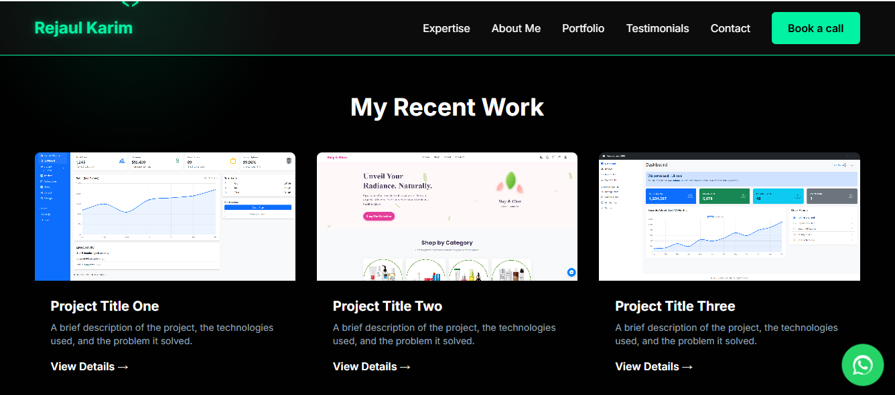

# Personal Portfolio – devrejaul

A clean, responsive portfolio website to showcase my projects, skills, and contact information.

## 🔗 Live Demo
- **Website:** https://devrejaul.github.io/

## ✨ Features
- Responsive layout for mobile/desktop
- Smooth navigation and simple UI
- Project cards with images
- Contact/social links
- Lightweight (HTML, CSS, JS only)

## 🧰 Tech Stack
- HTML5
- CSS3
- JavaScript (vanilla)

## 📁 Folder Structure
```
.
├── index.html
├── style.css
├── script.js
├── img/
│   ├── screenshot-hero.png
│   ├── screenshot-work-1.png
│   ├── screenshot-work-2.png
│   └── screenshot-work-3.png
└── css/ (optional, if you split styles)
```

## 🚀 Getting Started (Run Locally)
1. Clone the repo:
   ```bash
   git clone https://github.com/devrejaul/<your-repo>.git
   cd <your-repo>
   ```
2. Open `index.html` directly in your browser  
   *(or use a simple server)*:
   ```bash
   # Python 3
   python -m http.server 5500
   # then visit http://localhost:5500
   ```

## 🌐 Deploy on GitHub Pages
1. Push code to the `main` branch.
2. GitHub → **Settings → Pages**
3. **Source:** “Deploy from a branch” → **Branch:** `main` → **/(root)** → **Save**
4. Your site will be live at the link above.

> **Tip:** Use **relative paths** like `./img/...`, `./script.js`, and `./style.css` so assets load correctly on Pages.

## 📸 Screenshots
### Hero section


### Recent Work
| Project One | Project Two | Project Three |
|-------------|-------------|---------------|
|  |  |  |

> Save your actual screenshots using the above file names in the `img/` folder.

## 🔧 SEO Notes (optional)
Add these tags in `index.html` for better previews and search results:
```html
<title>Rejaul Karim — Full-Stack Web Developer (devrejaul)</title>
<meta name="description" content="Portfolio of Rejaul Karim (devrejaul): HTML, CSS, JavaScript/React, PHP/Laravel, Node.js, MySQL.">
<meta property="og:title" content="Rejaul Karim — Web Developer">
<meta property="og:description" content="Portfolio and projects by devrejaul.">
<meta property="og:image" content="https://devrejaul.github.io/img/og-cover.png">
<meta name="twitter:card" content="summary_large_image">
```

## 🗺️ Roadmap
- [ ] Add project filter/search
- [ ] Dark mode
- [ ] Contact form (Email/Backend)

## 📝 License
MIT © 2025 Rejaul Karim

## 📬 Contact
- **Email:** <your-email@example.com>
- **LinkedIn:** https://www.linkedin.com/in/<your-handle>/
- **GitHub:** https://github.com/devrejaul
